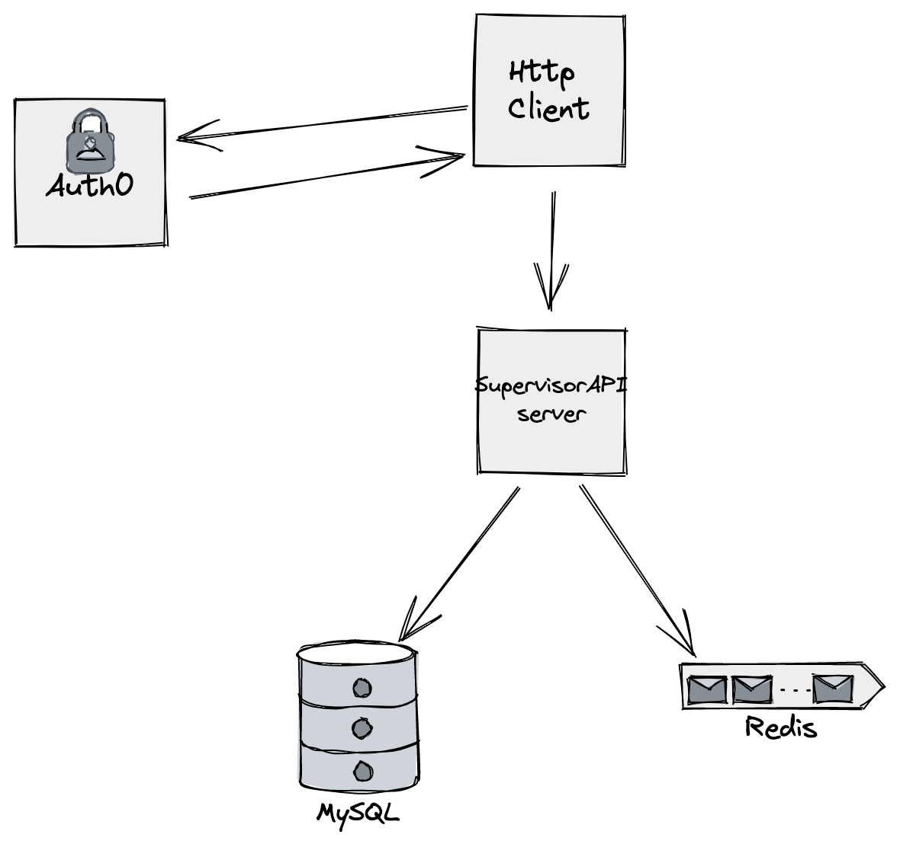

# SupervisorAPI
Task managing API for managers and technicians

## Contents     

- [What is Supervisor API](#what-is-supervisor-api) 
    - [Architecture](#architecture) 
    - [Summary](#summary) 
    - [Features](#features) 
- [Instructions](#instructions) 
    - [Auth0 Integration](#auth0-integration) 
    - [Auth2 Client Configuration](#auth2-client-configuration) 
    - [Development Environment](#development-environment)
        - [Development Requirements](#development-requirements) 
        - [Project Environment variables](#project-environment-variables) 
        - [Setting Up Local Environment](#setting-up-local-environment) 
        - [Run project](#run-project) 
        - [Monitor Development Redis](#monitor-development-redis)
    - [Docker Compose Environment](#docker-compose-environment)
        - [Docker Compose Requirements](#docker-compose-requirements) 
        - [Docker Environment variables](#docker-environment-variables) 
        - [Setting Up Docker Compose Environment](#setting-up-docker-compose-environment) 
        - [Run Docker Compose](#run-docker-compose) 
        - [Monitor Docker Compose Redis](#monitor-docker-compose-redis)
    - [Kubernetes Environment](#k8s-environment)
        - [K8s Requirements](#k8s-requirements) 
        - [K8s Environment variables](#k8s-environment-variables) 
        - [Setting Up K8s Environment](#setting-up-local-environment) 
        - [Run K8s](#run-k8s) 
- [Available Endpoints](#available-endpoints) 
    - [Endpoint contract](#endpoint-contract) 
    - [Get Task By ID](#get-task-by-id) 
    - [Get Task List](#get-task-list) 
    - [Create Task](#create-task) 
    - [Update Task](#update-task) 
    - [Delete Task](#delete-task) 
- [Testing and Coverage](#testing-and-coverage)

# What is Supervisor API
## Architecture

## Summary
Supervisor API is an API that allows CRUD operations on Tasks. This API leverages role based credentials configured and managed in an external Oauth2 authentication service has access permissions.
Existing roles and allowed actions are differentiated by access control:
- Manager
    - Create tasks
    - Update own tasks
    - Fetch any task by task identifier
    - List any tasks by query parameters
- Technician
    - Create tasks
    - Update own tasks
    - Fetch own task by task identifier
    - List own tasks by query parameters

Available endpoints are show on this document [api endpoint section](#available-endpoints). All endpoints have a CRUD interaction with the MySQL database, but the endpoint responsible by creating a new task also adds an event to the Redis queue (if available).
There is no subscriber service to the queue, so in order to monitor queue activity, depending on the environment I suggest using the redis-cli in the redis [development Docker container](#monitor-development-redis) container or redis [Docker Compose container](#monitor-docker-compose-redis).

## Features
    [x] Task summary is constraint to 2500 characters
    [x] Task summary is encrypted on database
    [x] Task List endpoints query by "worker_name"
    [x] Task List endpoints query by date "after"
    [x] Task List endpoints query by date "before"
    [x] Use Redis as message broker for newly created tasks
# Instructions

## Auth0 integration
This API uses Auth0, an external authentication service. For testing porpuses, for the default environment variables present in the [.env](https://github.com/MrBolas/SupervisorAPI/blob/b90ce1c7519fe3a813d4515b5aef018027e2f346/.env) the service will use a set of configured test users.

| User          | Password        | Email                   | Role      |
| ------------- |-----------------| ------------------------|-----------|
| Robert        | Robert1234      | robert@supervisor.com   |Manager    |
| Joseph        | Joseph1234      | joseph@supervisor.com   |Technician |
| Cassandra     | Cassandra1234   | cassandra@supervisor.com|Technician |

## Auth2 Client Configuration
Any http client used with this service should use a "Resource Owner Password Credentials" Grant type with the following configurations:

| Configuration    | Value (for default Auth0 integration)                      |
| -----------------|------------------------------------------------------------|
| Username         | [User email](#auth0-integration)                           |
| Password         | [Password](#auth0-integration)                             |
| Access Token Url | https://dev-04detuv7.us.auth0.com/oauth/token              |
| Client ID        | [AUTH0_CLIENT_ID](#project-environment-variables)          |
| Client Secret    | [AUTH0_CLIENT_SECRET](#project-environment-variables)      |
| Scope            | openid profile email                                       |
| Audience         | https://dev-04detuv7.us.auth0.com/api/v2/                  |

To falicitate the usage of this API a export of Insomnia endpoints configuration is provided in the [project](https://github.com/MrBolas/SupervisorAPI/blob/6fedd7cbca98cb253a2227fadd771300d221ff37/InsomniaExport/Insomnia_export.json).
## Development Environment
### Development Requirements
1. Docker Destop running
2. Go version 1.17+

### Project Environment variables
Default environment variables are defined in the [.env](https://github.com/MrBolas/SupervisorAPI/blob/6fedd7cbca98cb253a2227fadd771300d221ff37/.env) file. In this section I'll explain what they are:
| Variable              | Default                                                         | Description                      |
| ----------------------|-----------------------------------------------------------------|----------------------------------|
| MYSQL_USERNAME        | user                                                            | DB username                      |
| MYSQL_PASSWORD        | password                                                        | DB password                      |
| MYSQL_HOSTNAME        | localhost                                                       | DB address                       |
| MYSQL_PORT            | 3306                                                            | DB port                          |
| MYSQL_DATABASE        | sh_supervisor                                                   | DB name                          |
| AUTH0_DOMAIN          | dev-04detuv7.us.auth0.com                                       | auth0 domain address             |
| AUTH0_CLIENT_ID       | fmSt7Lf2b2mQr5LYpsSKglJYMy5YZiJd                                | auth0 clientID                   |
| AUTH0_CLIENT_SECRET   | zw78e03sMF7AqWzQ-ekzTZgqqL93YTxaPwzKxIYNr-KG5aih5eHq2R-rrgy6m-aJ| auth0 client Secret              |
| AUTH0_PUBLIC_KEY_URL  | https://dev-04detuv7.us.auth0.com/.well-known/jwks.json         | auth0 public key                 |
| CRYPTO_KEY            | skidMAhiçWdh34KlosQLP84GhT62smn                                 | Encryption key for sensitive data|
| REDIS_HOST            | localhost                                                       | Redis address                    |
| REDIS_PORT            | 6379                                                            | Redis Port                       |
| REDIS_DB              | 0                                                               | Redis DB                         |

## Setting Up Local Environment
1. Launch MySQL docker container (default environment variables already configured)
```shell
 docker run --name sh_mysql -p 3306:3306 -e MYSQL_ROOT_PASSWORD=password -e MYSQL_PASSWORD=password -e MYSQL_DATABASE=sh_supervisor -e MYSQL_USER=user -d mysql:5.7
```
2. Launch Redis docker container
```shell
docker run --name some-redis -d redis
```
## Run project
1. Git clone
```shell
git clone https://github.com/MrBolas/SupervisorAPI.git
```
2. Navigate to folder and fetch external packages
```shell
go get -d -v ./...
```
3. Install packages
```shell
go install -v ./...
```
4. Build
```shell
go build
```
5. Run executable
```shell
./SupervisorAPI
```
The SupervisorAPI configured port is 8080.
### Monitor Development Redis
To validate incoming notifications we can use:
```shell
docker exec -it some-redis redis-cli -h localhost subscribe notifications
```
This command subscribes to the topic notifications in redis-cli inside the docker container some-redis, and will show received messages received for that topic.
## Docker Compose Environment
### Docker Compose Requirements
1. Docker Destop running
### Docker Environment variables
Default environment variables are defined in the [.env-docker](https://github.com/MrBolas/SupervisorAPI/blob/6fedd7cbca98cb253a2227fadd771300d221ff37/.env-docker) file. In this section I'll explain what they are:
| Variable              | Default                                                         | Description                      |
| ----------------------|-----------------------------------------------------------------|----------------------------------|
| MYSQL_USERNAME        | user                                                            | DB username                      |
| MYSQL_PASSWORD        | password                                                        | DB password                      |
| MYSQL_HOSTNAME        | db                                                              | DB address                       |
| MYSQL_PORT            | 3306                                                            | DB port                          |
| MYSQL_DATABASE        | sh_supervisor                                                   | DB name                          |
| AUTH0_DOMAIN          | dev-04detuv7.us.auth0.com                                       | auth0 domain address             |
| AUTH0_CLIENT_ID       | fmSt7Lf2b2mQr5LYpsSKglJYMy5YZiJd                                | auth0 clientID                   |
| AUTH0_CLIENT_SECRET   | zw78e03sMF7AqWzQ-ekzTZgqqL93YTxaPwzKxIYNr-KG5aih5eHq2R-rrgy6m-aJ| auth0 client Secret              |
| AUTH0_PUBLIC_KEY_URL  | https://dev-04detuv7.us.auth0.com/.well-known/jwks.json         | auth0 public key                 |
| CRYPTO_KEY            | skidMAhiçWdh34KlosQLP84GhT62smn                                 | Encryption key for sensitive data|
| REDIS_HOST            | queue                                                           | Redis address                    |
| REDIS_PORT            | 6379                                                            | Redis Port                       |
| REDIS_DB              | 0                                                               | Redis DB                         |

### Setting Up Docker Compose Environment
The deployment orchestrated in the [docker-compose.yaml](https://github.com/MrBolas/SupervisorAPI/blob/6fedd7cbca98cb253a2227fadd771300d221ff37/docker-compose.yaml). 
The deployment is composed of three diferent services:
| Docker alias          | Service Name       |
| ----------------------|--------------------|
| supervisorapi         | Supervisor API     |
| db                    | MySql Database     |
| queue                 | Redis              |
```yaml
version: '3'
services:
  supervisorapi:
    build:
      context: .
    image: mrbolas/supervisorapi:0.1.0
    ports:
      - "8080:8080" # http
    env_file:
      - .env-docker
    depends_on:
      - db
      - queue
    restart: on-failure

  db:
    image: mysql:5.7
    ports:
      - "3306:3306"
    environment:
      MYSQL_USER: user
      MYSQL_PASSWORD: password
      MYSQL_ROOT_PASSWORD: password
      MYSQL_DATABASE: sh_supervisor
    volumes:
      - db-data:/var/lib/mysql
    restart: unless-stopped

  queue:
    image: redis
    restart: always
    ports:
      - '6379:6379'

volumes:
 db-data:
```
### Run Docker Compose
```shell
docker-compose up
```
The SupervisorAPI exposed configured port is 8080.
### Monitor Docker Compose Redis
To validate incoming notifications we can use:
```shell
docker exec -it supervisorapi_queue_1 redis-cli -h localhost subscribe notifications
```
This command subscribes to the topic notifications in redis-cli inside the docker container some-redis, and will show received messages received for that topic.
## K8s Environment

### K8s Requirements
1. Docker Destop running with K8s active
### K8s Environment variables
K8s deployment uses the same environment variables has [docker-compose](#docker-environment-variables)

### Setting Up K8s Environment
K8s files are generated by [kompose](https://kompose.io/) from the docker-compose file.
```shell
kompose --file docker-compose.yaml convert
```
These files are stored in the /k8s directory inside the project.
### Run K8s
To deploy the project in Kubernetes navigate to supervisorapi/k8s apply the K8s configuration files generated by Komposer. This will expose the supervisorAPI endpoints on port 30080
```shell
kubectl apply -f supervisorapi-pod.yaml,db-data-persistentvolumeclaim.yaml,db-deployment.yaml,db-service.yaml,queue-deployment.yaml,queue-service.yaml,supervisorapi-pod.yaml,supervisorapi-service.yaml
```
Additionally, it's needed to create a config map for the env-docker file wherre we store the environment variables.
```shell
kubectl create configmap env-docker --from-env-file=.env-docker
```

# Available Endpoints
## Endpoint contract
The Supervisor API endpoints are depicted in the [contract.yml](https://github.com/MrBolas/SupervisorAPI/blob/ff4b37cc7577d9ec53ebc16418fd724a269fb371/docs/contract.yml) according to the standard OpenApi and can be conveniently formated into html in [swagger](https://editor.swagger.io/).

## Get Task By ID
Fetches the Task with ID sent as Path parameter.
- Access:
    - Manager:
    - Technician: Can only access own tasks
- Verb: Get
- Parameters
    - id: /v1/tasks/{task-id}
        - format: uuid
- Responses:
    - 200:
        - body:
            ```json
            {
            "id": "3fa85f64-5717-4562-b3fc-2c963f66afa6",
            "worker_name": "string",
            "summary": "string",
            "date": "string"
            }
            ``` 
    - 401:
    - 404:

## Get Task List
Fetches list of Tasks filtered by query parameters.
- Access:
    - Manager:
    - Technician: Can only access own tasks
- Verb: Get
- Parameters
    - worker_name: /v1/tasks?worker_name={worker_name}
    - before: /v1/tasks?before={before_date}
        - format: "2022-05-23 15:33:01"
    - after: /v1/tasks?after={after_date}
        - format: "2022-05-23 15:33:01"
    - page: /v1/tasks?page={page_number}
    - page_size: /v1/tasks?page_size={page_size_number}
    - sort_by: /v1/tasks?sort_by={sort_field}
    - sort_order: /v1/tasks?sort_order={sort_order}
    
- Responses:
    - 200:
        - body:
            ```json
            {
            "data": [
                {
                "id": "3fa85f64-5717-4562-b3fc-2c963f66afa6",
                "worker_name": "string",
                "summary": "string",
                "date": "string"
                }
            ],
            "metadata": {
                "page": 0,
                "page_size": 0
            }
            }
            ``` 
    - 401:
    - 404:
## Create Task
Creates a new Task and sends an event to queue.
- Access:
    - Manager:
    - Technician:
- Verb: Post
- Body:
    ```json
    {
    "summary": "string",
    "date": "string"
    }
    ```
- Responses:
    - 201:
        - body:
            ```json
            {
            "id": "3fa85f64-5717-4562-b3fc-2c963f66afa6",
            "worker_name": "string",
            "summary": "string",
            "date": "string"
            }
            ``` 
    - 400:
    - 401:
    - 409:
## Update Task
Updates a Task by Id.
- Access:
    - Manager:
    - Technician: Can only access own tasks
- Verb: Put
- Parameters
    - id: /v1/tasks/{task-id}
        - format: uuid
- Body:
    ```json
    {
    "summary": "string",
    "date": "string"
    }
    ```
- Responses:
    - 200:
        - body:
            ```json
            {
            "id": "3fa85f64-5717-4562-b3fc-2c963f66afa6",
            "worker_name": "string",
            "summary": "string",
            "date": "string"
            }
            ``` 
    - 400:
    - 401:
    - 404:
    - 409:
## Delete Task
Deletes a Task.
- Access:
    - Manager:
- Verb: Delete
- Parameters
    - id: /v1/tasks/{task-id}
        - format: uuid
- Responses:
    - 204:
    - 401:
    - 404:
    - 409:

# Testing and Coverage
This code repository test coverage for the api codebase. There are several unit tests covering the code base. Additionaly there are integration tests for the MySql Database using [Dockertest](https://github.com/ory/dockertest) and [Testify](github.com/stretchr/testify).
To run the test in code coverage:
```shell
go test ./... -cover
```

Currently the output for the test cover:
```shell
?       github.com/MrBolas/SupervisorAPI        [no test files]
?       github.com/MrBolas/SupervisorAPI/api    [no test files]
ok      github.com/MrBolas/SupervisorAPI/auth   (cached)        coverage: 31.0% of statements
ok      github.com/MrBolas/SupervisorAPI/encryption     (cached)        coverage: 82.6% of statements
ok      github.com/MrBolas/SupervisorAPI/handlers       (cached)        coverage: 76.6% of statements
ok      github.com/MrBolas/SupervisorAPI/models (cached)        coverage: 85.0% of statements
ok      github.com/MrBolas/SupervisorAPI/repositories   (cached)        coverage: 79.7% of statements
```